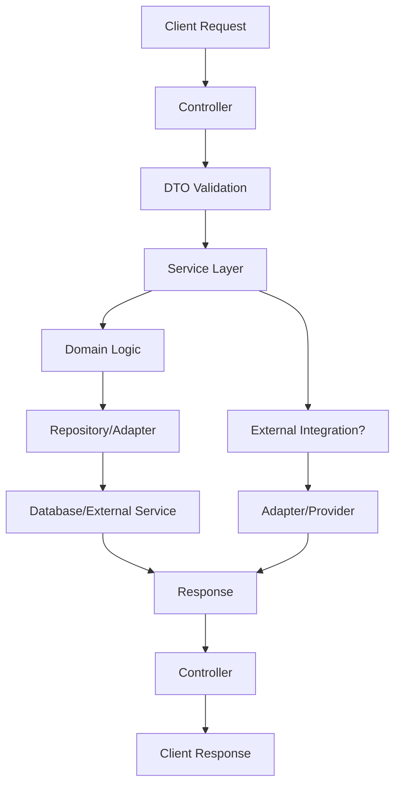

# Data Flow & Integrations

This document explains how data enters, moves through, and exits the backend system, including internal module interactions and external integrations.

## Module Dependencies

- **src/modules/users** → `core/services`, `core/interface`, `core/exceptions`
- **src/modules/transactions** → `core/services`, `core/interface`, `core/exceptions`, `modules/users`
- **src/modules/file** → `core/services`, `core/interface`
- **src/modules/auth** → `core/services`, `core/interface`, `modules/users`
- **src/modules/attachments** → `core/services`, `core/interface`, `modules/file`
- **core/services** → `core/config`, `core/constants`
- **controllers** → `services`, `dtos`, `domain/usecase`

## Service Layer

- [ConfigurationService](../../src/core/services/configuration.service.ts)
- [EncryptionService](../../src/core/services/encryption.service.ts)
- [JsonWebTokenService](../../src/core/services/json_web_token.service.ts)
- [TypeormUnitOfWork](../../src/core/services/typeorm_unit_of_wor.service.ts)
- [CreateUserService](../../src/modules/users/application/create_user.service.ts)
- [CreateTransactionService](../../src/modules/transactions/application/create_transaction.service.ts)
- [CreateAttachmentService](../../src/modules/attachments/application/create_attachment.service.ts)
- [UploadFileService](../../src/modules/file/application/upload_file.service.ts)
- [ExtractUserService](../../src/modules/auth/application/extract_user.service.ts)
- [LoginService](../../src/modules/auth/application/login.service.ts)
- [RefreshTokenService](../../src/modules/auth/application/refresh_token.service.ts)

## High-level Flow

1. **Input**: HTTP requests are received by controllers (e.g., user registration, transaction creation).
2. **Validation**: DTOs validate and transform incoming data.
3. **Business Logic**: Controllers delegate to services, which orchestrate domain logic and interact with repositories.
4. **Persistence**: Services use repositories/adapters to read/write data to the database or external storage.
5. **Output**: Results are returned to controllers, which format HTTP responses.
6. **External Integrations**: Some flows interact with file storage, authentication providers, or other services via adapters.

## Internal Movement

Modules communicate primarily through service calls and shared interfaces. There is no event bus or message queue; all interactions are synchronous and in-process. Shared DTOs and interfaces enforce contracts between modules.

## External Integrations

- **Database**: Primary data persistence, accessed via repositories.
- **JWT Authentication**: Token verification for user sessions.
- **File Storage**: Abstracted via adapters for uploading and retrieving files.
- **Potential SaaS**: Future integrations may include payment or notification services.

## Observability & Failure Modes

- **Logging**: Errors and key events are logged via exception handlers.
- **Validation**: DTOs and value objects enforce data integrity.
- **Error Handling**: Custom exceptions and guards manage authentication and domain errors.
- **Resilience**: Retry logic and error responses are handled at the service and controller layers.

## Related Resources

- [Architecture](./architecture.md)